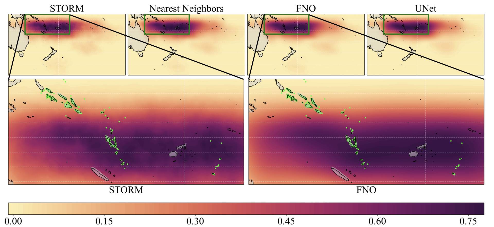

# EMPIRIC_TC

EMPIRIC TC is Fourier Neural Operator deep-learning emulator of a statistical-dynamical tropical cyclone model. It provides site-specific, accessible, and statistically sound projections of high-intensity tropical cyclones in the South Pacific.


Figure 1. Example outputs from the statistical dynamical model (STORM) and three machine learning models, including the FNO EMPIRIC_TC model. Green points mark health facilities in the South Pacific.

## Set Up

1. Install Python if you don’t already have it. I am using python version 3.11.9. I would recommend using the this version because there are some issues with using the most recent Python release. You can find the installers here: https://www.python.org/downloads/release/python-3119/
2. Install git: https://git-scm.com/download/win for windows or https://git-scm.com/download/mac for mac. On windows, if it has an option in the install like “Use git in Windows command prompt”, select yes.
3. Get the latest release of the code locally by opening the command line and running: `git clone https://github.com/EMPIRIC2/EMPIRIC_TC.git --branch v1.0` 
    1. You’ll need to do some authentication for your github account, you can do this by making a personal access token through your github account here: https://github.com/settings/tokens. There is also a guide on this here: https://docs.github.com/en/authentication/keeping-your-account-and-data-secure/managing-your-personal-access-tokens
    2. this will put the project folder in your current working directory, so make sure to move to the directory you want to use in the command line
4.  Move into the code folder: `cd EMPIRIC-AI-emulation` 
5. Set up the conda environment: `conda env create -f env.yml`
6. Activate the conda environment: `conda activate ml_env`
7. Download the model and test data files from the manuscript release version: https://github.com/EMPIRIC2/EMPIRIC_TC/releases/tag/v1.0
8. Move the saved model you have downloaded into the folder EMPIRIC-AI-emulation/saved_models
9. To run the STORM model directly, you must download the storm_data.zip file from the most recent release (see above), unzip it, and add all the files to the EMPIRIC-AI-emulation/STORM folder.

## Example code

### Running the models

Saved models are stored in `./saved_models/` and can be loaded from `saved_models.saved_models`. 

The three current models are DDPMUNet_model, STORM_model and NearestNeighbors_model.
Raw input data can be loaded from HDF5 files using the `raw_input_generator("path/to/data/file.hdf5")`.

Otherwise, models all expect a (6, 55, 105) float-valued numpy ndarray representing the relative 
spatial frequency of genesis events (the scale does not matter 
since they are normalized before inputting to the deep learning model).

For example, this code shows evaluating an input for both the deep learning model and STORM.

```python
from saved_models.saved_models import FNO_model
model = FNO_model()

# for a model input x, x is a (6, 55, 105) numpy array
y = model(x)
# get a model prediction y, y is a (110, 210, 1) numpy array

# Or

from saved_models.saved_models import STORM_model
model = STORM_model(total_years=1, n_years_to_sum=1, n_samples=1)

y = model(x)
```

There is an example of this in the notebook `example_code/prediction_example.ipynb`. 
To run the example code, update the data_file path to point to the file "example_data.hdf5" that you downloaded from the release.

### Generating synthetic tropical cyclone data
There is an example script showing how to run the model evaluation pipeline in `example_code/generate-data-example.sh`.

### Evaluating the models

There is an example showing how to evaluate the machine learning models in `example_code/evaluate_models.sh`.

### Training the FNO model

There is example code showing how the FNO model is trained in `example_code/train_fno_example.ipynb`.

## Figures

Figures are generated by the model evaluation script and in individual jupyter notebooks contained in `notebooks`.

## License

MIT License

Copyright (c) 2025 Eli Winkelman, Chris Horvat, Michelle McCrystall

Permission is hereby granted, free of charge, to any person obtaining a copy
of this software and associated documentation files (the "Software"), to deal
in the Software without restriction, including without limitation the rights
to use, copy, modify, merge, publish, distribute, sublicense, and/or sell
copies of the Software, and to permit persons to whom the Software is
furnished to do so, subject to the following conditions:

The above copyright notice and this permission notice shall be included in all
copies or substantial portions of the Software.

THE SOFTWARE IS PROVIDED "AS IS", WITHOUT WARRANTY OF ANY KIND, EXPRESS OR
IMPLIED, INCLUDING BUT NOT LIMITED TO THE WARRANTIES OF MERCHANTABILITY,
FITNESS FOR A PARTICULAR PURPOSE AND NONINFRINGEMENT. IN NO EVENT SHALL THE
AUTHORS OR COPYRIGHT HOLDERS BE LIABLE FOR ANY CLAIM, DAMAGES OR OTHER
LIABILITY, WHETHER IN AN ACTION OF CONTRACT, TORT OR OTHERWISE, ARISING FROM,
OUT OF OR IN CONNECTION WITH THE SOFTWARE OR THE USE OR OTHER DEALINGS IN THE
SOFTWARE.


